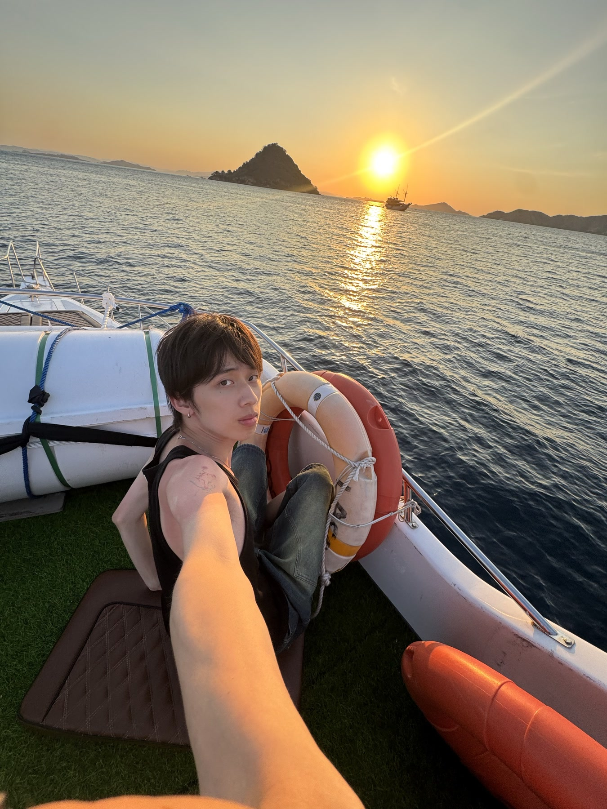
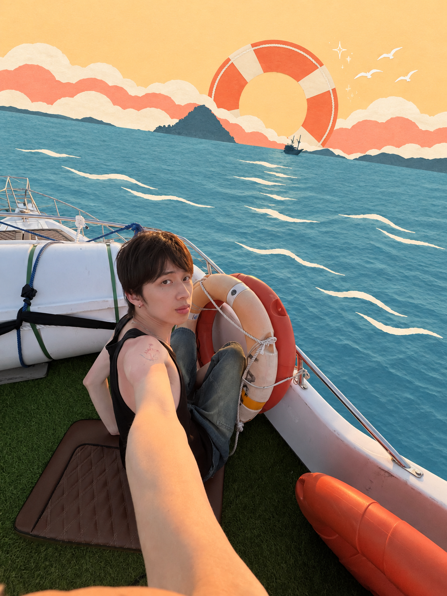
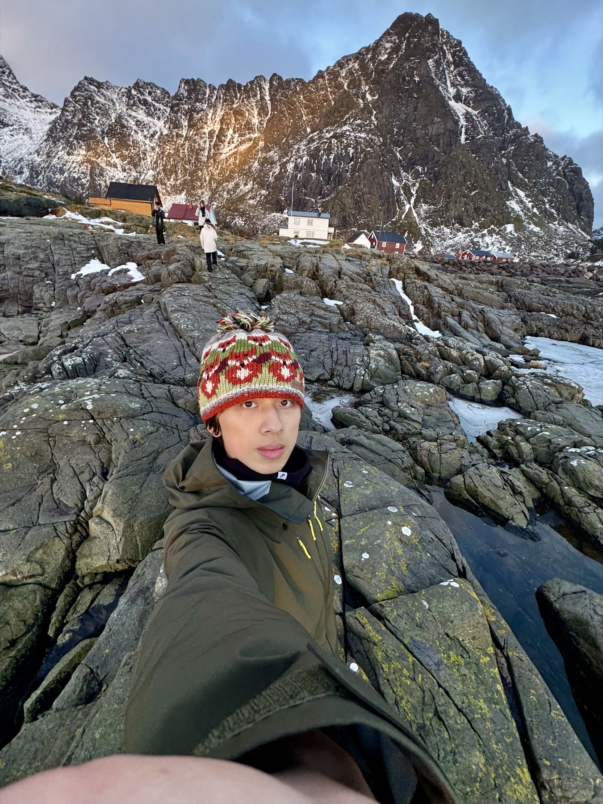
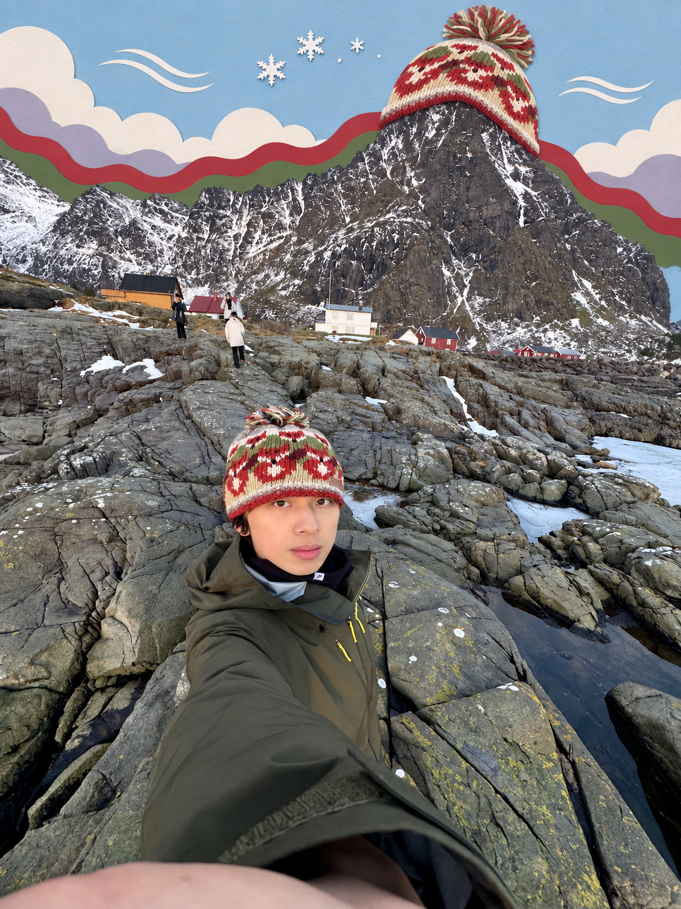
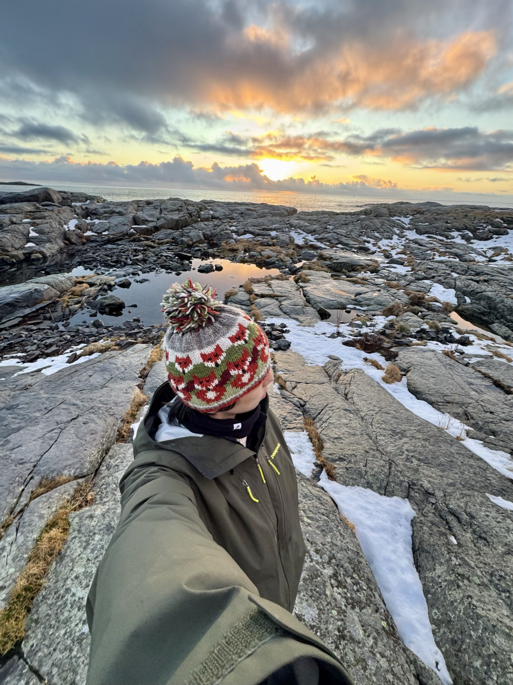
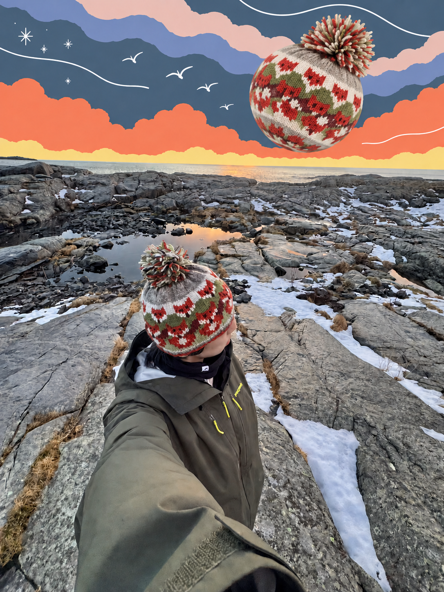
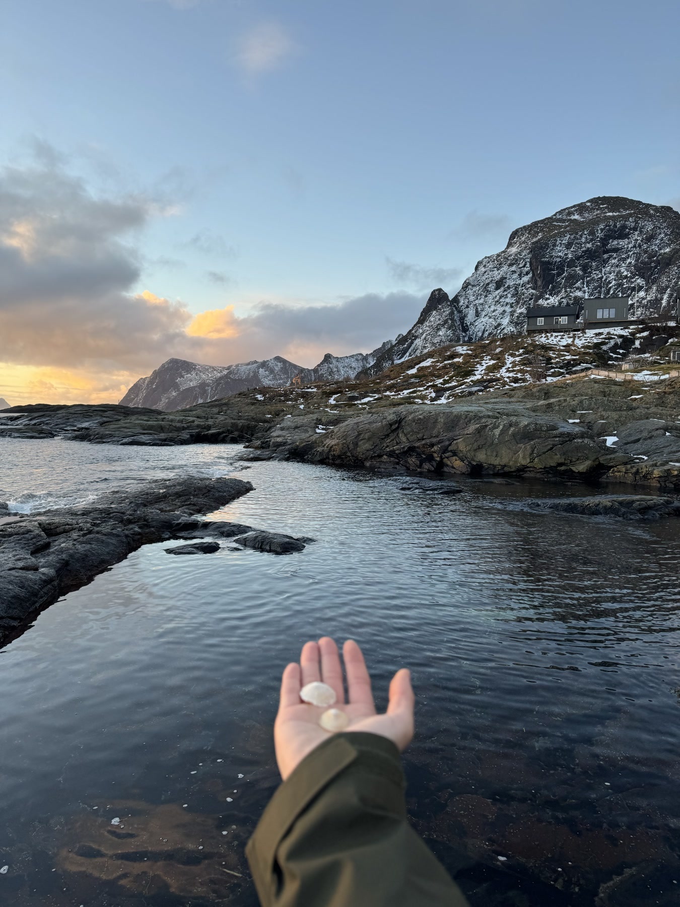
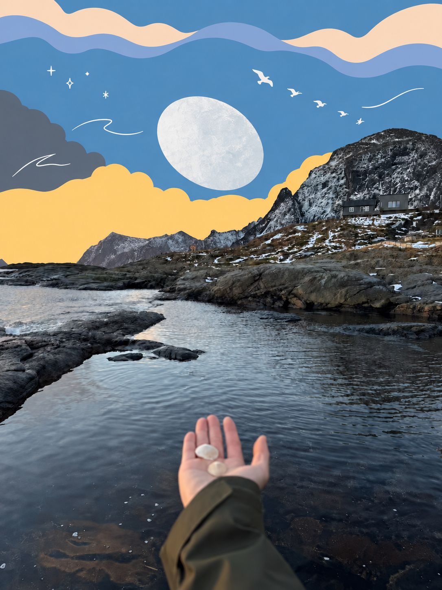

# 童话异想拼贴 · Storybook Surreal Collage

一个把真实照片改造成童话绘本感超现实剪纸拼贴的 AI agent skill。

人物、前景和未编辑区域保留原始自然色与摄影质感；天空或背景被组织成远、中、近三层平涂剪纸色形；画面只允许出现一个源自原图或场景典故的“不可能巨物”。

> 真实留色、平涂梦境、一物不对劲、元素源于图、色从图中来。

## 效果对照

### 1. 海上日落：救生圈变成海平线上的巨型日轮

| 原图 | 原色生成结果 |
| --- | --- |
|  |  |

### 2. 雪山自拍：山峰戴上同款针织帽

| 原图 | 原色生成结果 |
| --- | --- |
|  |  |

### 3. 冬日海岸：针织帽化成漂浮巨物

| 原图 | 原色生成结果 |
| --- | --- |
|  |  |

### 4. 海湾贝壳：掌心贝壳升入童话天空

| 原图 | 原色生成结果 |
| --- | --- |
|  |  |

仓库中的展示图均为移除 EXIF、GPS、拍摄时间和设备信息后的副本。

## 适合什么

- 把旅行照、人像、城市或风景照做成明亮的童话异想拼贴
- 保留人物肤色、服装和前景，只改天空或指定背景
- 制作适合短视频、社交媒体封面与图文内容的视觉作品
- 避免默认红日、蓝天、鲸鱼等模板化元素，让巨物和配色真正来自原图

## 安装

将整个 `storybook-surreal-collage` 文件夹复制到所用 agent 的 skills 目录。

### 一句话安装并使用

把下面这句话和需要处理的照片一起发给支持安装 GitHub skill 的 agent：

```text
请安装 https://github.com/1539777565-alt/storybook-surreal-collage 里的 storybook-surreal-collage skill，然后使用它处理这张图片。
```

安装完成后，也可以直接说：

```text
使用 $storybook-surreal-collage 处理这张图片。
```

Codex 示例：

```text
~/.codex/skills/storybook-surreal-collage/
```

安装后可以这样调用：

```text
使用 $storybook-surreal-collage，把这张照片改造成童话异想拼贴。
```

也可以提出局部要求：

```text
使用 $storybook-surreal-collage，只改天空，人物、前景和原始颜色保持不变。
```

完整的场景分析、色形推导、巨物选择、Prompt 编译、纠偏与质量检查规则见 [`SKILL.md`](SKILL.md)。

## 来源与许可

- 上游项目：[`surreal-pop-collage`](https://github.com/2998980-hue/surreal-pop-collage)，MIT License。
- 本项目是基于该项目的衍生修改版，不是上游作者的官方版本。
- 原项目的版权声明和 MIT 许可文本保留在 [`LICENSE`](LICENSE) 中。
- 本版本修改由 [Xiaohao.ooo](https://github.com/1539777565-alt) 完成，并继续以 MIT License 发布。

使用照片时，请自行确认对照片、人物肖像及第三方素材拥有必要授权。
